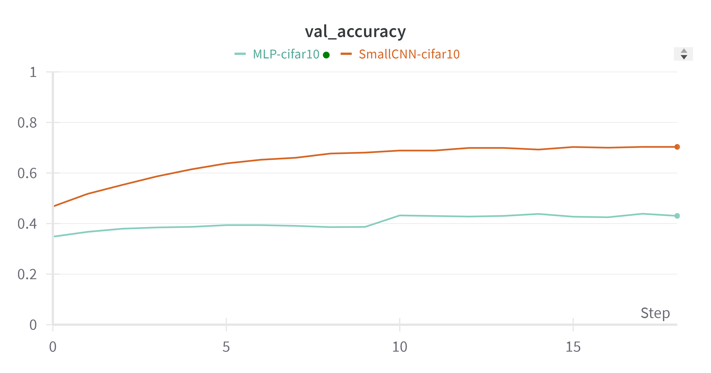
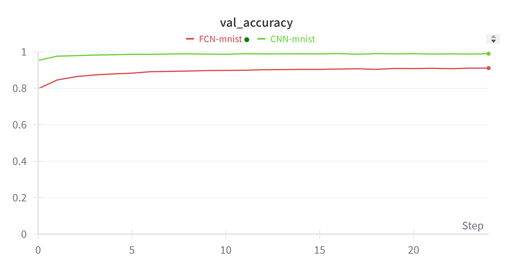

# Lab. 1 - CNNs
This lab is about Convolutional Neural Networks (CNNs). In the following exercises we will explore the basic building blocks of CNNs and use them to solve simple classification tasks. Furthermore we will analyze the behaviour and the performances of various different architectures and techniques. Finally, we will implement Grad-CAM on our CNN to give a visual explanation of the decisions made by the network.

## Installation
To run the code in this repository, you need to install the following dependencies:
- `pip3 install torch torchvision torchaudio --index-url https://download.pytorch.org/whl/cu118`  
- `pip install matplotlib`  
- `pip install scikit-learn`  
- `pip install tqdm`  
- `pip install jupyterlab`  
- `pip install ipython`  
- `pip install wandb`  
- `pip install opencv` 

## Introduction
- `Lab1.ipynb` constains the notebook with complete code of the solved exercises (they are not shown all the results).
- `./images` is the directory where they are saved all the resulting plot displayed in this report.  
- `./trained_models` contains some of the models trained in the exercises. Note that heavier models are not included in the repository.  
- This report contains the informations about how the exercises are solved and it shows the most significant results.

## Exercise 1 - MLP and Convolutional Neural Networks
Firstly, we implement a simple MLP to classify a very easy dataset like MNIST. 
Then, we observe the difference in terms of performances with a CNN, both on MNIST and CIFAR-10.
Finally, we implement a ResNet architecture and compare its performances with the previous models.  
For every experiment, the training is performed with an early stopping technique based on the validation loss, so the curves displayed could be shorter than the maximum number of epochs.

### MLP vs CNN
 MNIST |   CIFAR10 |
|:-----------------------------:|:----------------------------:|
|  |    

Although the architectures are very simple, they are informative about the outperforming of CNN with respect to MLP on both datasets. While MLP seems to obtain good results on handwritten digits, it struggles with more complex images like the ones in CIFAR-10. The CNN, instead, is able to capture the spatial information of the images and therefore it is able to classify them better.  

### ResNet
Residual Networks are a type of CNN that are able to train very deep networks. They are composed of residual blocks, which are able to learn the identity function.
In this experiment we use four distnct architectures. Indeed, in addition to the previous models we implement a ResNet architecture with 16 convolutional layers, using a flag to enable or disable the residual blocks. So, the new model is much deeper than the previous ones and we expect it to be able to learn more complex features.
We will refer to the new model as ResNet and ConvNet, to distinguish them from the previous MLP and Small CNN.  
From the training curves we can deduce that deeper networks have performed better than the shallower ones, as expected. Particularly, the ResNet architecture with residual blocks has outperformed the other models, reaching an accuracy of 82% on CIFAR-10.

 Validation Loss |   Validation Accuracy |
|:-----------------------------:|:----------------------------:|
|  |   

  

| Model | Test Accuracy |
|:-----------------------------:|:----------------------------:|
| MLP | 0.4302 |
| Small CNN | 0.7028 |
| ConvNet | 0.7537 |
| ResNet | **0.8221** |  

## Exercise 2.2 - Fully Convolutional Network
In this section we adapt our simple CNN to be Fully-Convolutional, in order to create a network that predicts classification outputs at all pixels in an input image.  
We start by training the CNN on standard MNIST dataset. Then we build the FCN architecture by substituting the classification head with Convolutional and De-Convolutional layers. Finally we train the FCN on a custom MNIST dataset with image dimensions of 64x64 and random digit position.

 Validation Loss    |  Validation Accuracy
|:-----------------------------:|:----------------------------:|
|  |    
 
The results obtained are very interesting. The model is able to predict the correct label in the nearest pixel to the digit, but it struggles to predict the correct label in the sides of the image. Particularly, the model often predicts "1" for black pixels, maybe because 1 is the number with the highest amount of black pixels.

Label 7     |  Label 2
|:-----------------------------:|:----------------------------:|
|  |    
 

## Exercise 2.3 - Grad-CAM
In this last section we focus on the explanation of the decisions made by the network. We implement Grad-CAM, a technique that uses the gradients of any target concept flowing into the final convolutional layer to produce a coarse localization map highlighting the important regions in the image for predicting the concept.  
The following images show some examples of Grad-CAM applied on the CIFAR-10 dataset. We must consider that CIFAR-10 images are 32x32, so not very detailed, and the subject is almost always in the center of the picture, so the network usually focuses on the center of the image.  

