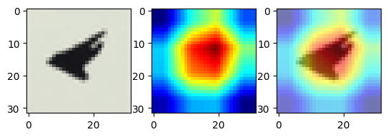
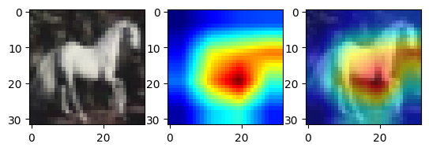

# Lab. 1 - CNNs
## Introduction
This lab is about Convolutional Neural Networks (CNNs). In the following exercises we will explore the basic building blocks of CNNs and use them to solve simple classification tasks. Furthermore we will analyze the behaviour and the performances of various different architectures and techniques. Finally, we will implement Grad-CAM on our CNN to give a visual explanation of the decisions made by the network.

## Exercise 1 - MLP and Convolutional Neural Networks
Firstly, we implement a simple MLP to classify a very easy dataset like MNIST. 
Then, we observe the difference in terms of performances with a CNN, both on MNIST and CIFAR-10.
Finally, we implement a ResNet architecture and compare its performances with the previous models.  
For every experiment, the training is performed with an early stopping technique based on the validation loss, so the curves displayed could be shorter than the maximum number of epochs.

### MLP vs CNN
 MNIST |   CIFAR10 |
|:-----------------------------:|:----------------------------:|
|  |    

Although the architectures chosen are not deeply optimized, they are informative about the outperforming of CNN with respect to MLP on both datasets. While MLP seems to obtain good results on handwritten digits, it struggles with more complex images like the ones in CIFAR-10. The CNN, instead, is able to capture the spatial information of the images and therefore it is able to classify them better.  

### ResNet
Residual Networks are a type of CNN that are able to train very deep networks. They are composed of residual blocks, which are able to learn the identity function.  
   
The ResNet architecture is not always better than a simple CNN without residual blocks, but generally it is able to reach better performances. Observing the training curves of our case, it seems that ResNet converges faster than the simple CNN, but the final accuracy is not significantly better. This is probably due to the fact that the dataset is not very complex and the network is not very deep.
 Validation Loss |   Validation Accuracy |
|:-----------------------------:|:----------------------------:|
|  |    

## Exercise 2.2 - Fully Convolutional Network
In this section we adapt our CNN to be Fully-Convolutional, in order to create a network that predicts classification outputs at all pixels in an input images. With this aim we substitute the final Linear layers with De-Convolution layers. The experiment was applied on MNIST dataset to predict handwritten digits. For testing, we create a custom MNIST dataset with different image dimensions (64x64) and with random digit position.  
  
As we can observe, the model predicts the correct label in most of nearest pixel to the digit, whereas it predicts almost random labels for pixel on the sides of the image.

## Exercise 2.3 - Grad-CAM
In this last section we focus on the explanation of the decisions made by the network. We implement Grad-CAM, a technique that highlights the regions of the image that are important for the classification. We apply it on the CIFAR-10 dataset, and we can see that the network focuses on the most important parts of the image.  
The following images show some examples of Grad-CAM applied on the CIFAR-10 dataset. We must consider that CIFAR-10 images are 32x32, so not very detailed, and the subject is almost always in the center of the picture, so the network usually focuses on the center of the image.  
An interesting point that appears from this study is that in some cases the network prediction is based wrong details of the images. An example is the last case, where the class "ship" is probably recognized by the network because of the blue background, and not because of the ship itself.

