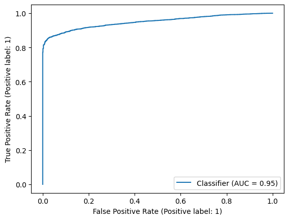
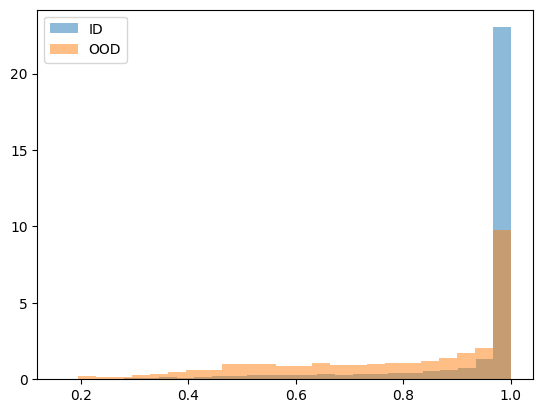

# Lab. 4 - Adversarial Learning and OOD Detection
In this laboratory we firstly explore the concept of Out-of-Distribution (OOD) detection and then we implement some techniques of adversarial attacks and defences.

## Exercise 1 - Out-of-Distribution Detection
In this section we build a simple OOD detection pipeline using some simple architectures. We OOD scorse are computed using the Maximum Softmax Probability (MSP) as in the paper [Hendrycks & Gimpel, 2017](https://arxiv.org/abs/1610.02136) and we evaluate the performance of the OOD detection with histograms and then with more advanced techniques like ROC curves and Precision-Recall curves.
We use the CIFAR-10 dataset for ID examples, while FakeData and CIFAR-100 (classes not in CIFAR-10) for OOD examples.

### Models
We use the following two model architectures for the OOD detection task:

| Model | Test Accuracy |
|--------------------|---------------|
|Simple Custom CNN   | 0.7147 |
|Pretrained ResNet   | 0.9260 |

### FakeData
The FakeData dataset is generated as Random Noise with the same shape as the CIFAR-10 dataset and with random labels.

| Simple Custom CNN | Pretrained ResNet |
|--------------------|---------------|
|||
|||
|||

### CIFAR-100
The OOD dataset is built using a Subset of CIFAR-100 with classes not present in CIFAR-10.

| Simple Custom CNN | Pretrained ResNet |
|--------------------|---------------|
|||
|||
|||

| Model | AUROC | AUPRC | FPR@95% TPR |
|--------------------|:-----------------------:|:-----------------------:|:-----------------------:|
| | FakeData / CIFAR-100 | FakeData / CIFAR-100 | FakeData / CIFAR-100 |
|Simple Custom CNN   | 0.6198 / 0.6912 | 0.9513 / 0.8884 | 0.992 / 0.885 |
|Pretrained ResNet   | 0.9498 / 0.7904 | 0.9950 / 0.9272 | 0.417 / 0.813

## Exercise 2 - Adversarial Attacks and Defences
In this section we implement the Fast Gradient Sign Method (FGSM) as a technique for adversarial attack.
FSGM perturbs samples in the direction of the gradient with respect to the input $\mathbf{x}$:
$$
\boldsymbol{\eta}(\mathbf{x}) = \varepsilon \mathrm{sign}(\nabla_{\mathbf{x}} \mathcal{L}(\boldsymbol{\theta}, \mathbf{x}, y))
$$
We qualitatively and quantitatively evaluate these attacks and then we try to increase the robustness of our model using adversarial training.  
For this and the following exercises we use the Simple Custom CNN model described above.

### FGSM Attack
Some FGSM attack examples are showed below, ordered by increasing epsilon value, from 0.001 to 0.1.

### Adversarial Training
We train the model by adding adversarial samples generated *on the fly* during the training process. We evaluate the performance of the adversarially trained model with respect to the non-adversarially trained one.

### Evaluation
We evaluate the performance of the attacks and of the adversarial training with the following metrics. The results are shown in terms of Attack Success Rate (ASR), visualizing how much the attack effect depends on the epsilon value and max number of iterations.

| Varying $\varepsilon$ (max iter = 1) | Varying Max Iter ($\varepsilon$ = 0.001) |
|--------------------|---------------------|
| | |

## Exercise 3.1 - ODIN
In this section we implement the ODIN method from the [ODIN paper](https://arxiv.org/abs/1706.02690). The method is based on the idea of detecting adversarial samples by measuring the temperature-scaled difference between the softmax output of the model and the softmax output of the model on the OOD samples.
Specifically the method is based on the following steps:
- **Temperature Scaling:** The softmax score is computed as
$$
S_{i}(\boldsymbol{x}, T) = \frac{\exp(f_{i}(\boldsymbol{x})/T)}{\sum_{j=1}^{C} \exp(f_j(\boldsymbol{x})/T)}
$$
where $f_j(\boldsymbol{x})$ is the output of the model for class $j$ and where $T$ is the temperature scaling parameter.
- **Input Preprocessing:** Preprocess the input image with a perturbation
$$
\boldsymbol{\tilde{x}} = \boldsymbol{x} - \varepsilon \mathrm{sign}(-\nabla_{\mathbf{x}} \log S_{\hat{y}}(\boldsymbol{x}, T))
$$
where the perturbation can be computed by back-propagating the gradient of the cross-entropy loss w.r.t the input.

- **OOD Detector:** The detector combines the two components described above. For each image $x$, we first calculate the preprocessed input $\tilde{x}$. Next, it feeds this input into the neural network, and it calculates its calibrated softmax score $S(\tilde{x}, T)$.  

We evaluate the performance of the ODIN method with the same metrics used for the MSP method. The results are shown below.

### FakeData

| Method | AUROC | AUPRC | FPR@95% TPR |
|--------|:--------:|:--------:|:--------:|
| MSP    | 0.9498 | 0.9950 | 0.417 |
| ODIN   | **0.9996** | **0.9999** | **0.0** |

From the results we can notice that ODIN is able to detect almost all the OOD samples, with a very low FPR in the case of FakeData.

| ROC Curve | Precision-Recall Curve |
|-----------|-------------------------|
|||

### CIFAR-100

| Method | AUROC | AUPRC | FPR@95% TPR |
|--------|:--------:|:--------:|:--------:|
| MSP    | 0.7904 | 0.9272 | 0.813 |
| ODIN   | **0.8807** | **0.9567** | **0.506** |

With images from CIFAR-100 the results are not as good as with FakeData, but still ODIN outperforms the Softmax Probability method in all the metrics considered.

| ROC Curve | Precision-Recall Curve |
|-----------|-------------------------|
|||

## Exercise 3.3 - Targeted FGSM
Finally, we implement the Targeted FGSM attack, where the adversarial samples are generated to be classified as a specific target class. The results are not too much different from the standard FGSM attack, but the number of iterations needed to reach the target class is higher. They are shown below some examples of targeted attacks.  

As in the previous case, we evaluate the performance of the attacks based on the epsilon value and the max number of iterations. The results are shown below.

| Varying $\varepsilon$ (max iter = 1) | Varying Max Iter ($\varepsilon$ = 0.001) |
|--------------------|---------------------|
| | |